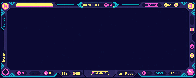

<p align="center">
  
</p>

<p align="center">
  
  
  
</p>

```
+--------------------------------------------------------------------------+
| PLAYER: Phuwanan Noiwaengpim                                             |
| TAG:    Aun-Phuwanan                                                     |
| ROLE:   Frontend developer who likes game-like UI, clean pages, and bots |
| STACK:  Vue / Nuxt / React / Next / TypeScript / Tailwind                |
+--------------------------------------------------------------------------+
```

## STATUS BOARD

<table>
  <tr>
    <td><b>LV.26</b><br />Profile in progress</td>
    <td><b>2</b><br />Featured worlds</td>
    <td><b>3</b><br />Main frontend skills</td>
    <td><b>24H</b><br />Quest ready</td>
  </tr>
</table>

## QUEST LOG

| Rank | World | Tech | Mission |
| --- | --- | --- | --- |
| 01 | [ProfileWeb](https://github.com/Aun-Phuwanan/ProfileWeb) | Vue / Nuxt / Tailwind | Personal web profile with chat bot, news board, i18n, dark mode, and PWA setup. |
| 02 | [Pantip](https://github.com/Aun-Phuwanan/Pantip) | Next / React / Tailwind | Forum-style community UI with cards, topics, navbar, and content routes. |

## SKILL INVENTORY

<p>
  
  
  
  
  
  
</p>

## WORLD MAP

```txt
[ HOME BASE ] ----> [ PROFILEWEB ]
     |                    |
     |                    +-- Chat bot room
     |                    +-- News board
     |                    +-- Language / theme system
     |
     +------------> [ PANTIP ]
                          |
                          +-- Forum cards
                          +-- Topic routes
                          +-- UI components
```

## GITHUB SAVE DATA

| Slot | Save File | Status |
| --- | --- | --- |
| A | Profile README world | Active |
| B | Vue / Nuxt project route | Open |
| C | React / Next project route | Open |

## CURRENT MAIN QUEST

- Build frontend pages that feel clear, playful, and responsive.
- Turn normal web screens into small game-like worlds.
- Keep learning better UI architecture, reusable components, and typed code.
- Ship projects that look alive on desktop and mobile.

<p align="center">
  
</p>
