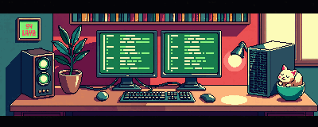

<h1 align="center">Hi there, I'm Aun-Phuwanan</h1>

  

  
  
  

<table>
  <tr>
    <td width="170" align="center">
      
    </td>
    <td>
      <h3>Pixel Art Web Developer</h3>
      

        I build playful frontend interfaces with Vue, Nuxt, React, Next.js,
        Tailwind CSS, and TypeScript. I like web pages that feel like small
        game worlds: clear, responsive, warm, and fun to explore.
      

      

        Current vibe: cozy retro workspace, clean UI, limited palette, and
        professional game-asset edges.
      

    </td>
  </tr>
</table>

  

## Tech Stack

<table>
  <tr>
    <td><b>Frontend</b></td>
    <td>Vue.js, Nuxt, React, Next.js, Tailwind CSS</td>
  </tr>
  <tr>
    <td><b>Language</b></td>
    <td>TypeScript, JavaScript</td>
  </tr>
  <tr>
    <td><b>Game UI Taste</b></td>
    <td>Pixel art, 16-bit UI, retro HUD, cozy isometric layouts</td>
  </tr>
  <tr>
    <td><b>Tools</b></td>
    <td>GitHub, Vercel, Firebase, PWA workflows</td>
  </tr>
</table>

## Current Project

> **Pixel Defense Earth**  
> Building a retro space defense game with a mobile-first pixel UI direction.

## Featured Worlds

| Project | Stack | What it shows |
| --- | --- | --- |
| [ProfileWeb](https://github.com/Aun-Phuwanan/ProfileWeb) | Vue / Nuxt / Tailwind | Personal web profile, chatbot, news board, i18n, dark mode, PWA setup |
| [Pantip](https://github.com/Aun-Phuwanan/Pantip) | Next / React / Tailwind | Forum-style cards, topic routes, reusable UI components |

  

## Pixel Dev Notes

- Limited palette first: navy, teal, amber, soft pink.
- Clean edges over noisy detail.
- UI should feel retro, but still read like a modern developer profile.
- Every section should feel like a small screen in a 2D game menu.

  

