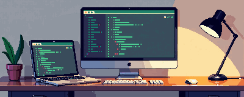

<h1 align="center">Hi, I'm Aun-Phuwanan</h1>

  <b>Web Developer</b> who enjoys clean interfaces, frontend tools, and pixel art aesthetics.

  

  
  
  

## About

I'm a web developer focused on building practical, responsive frontend experiences.
I like pixel art as a visual style, but my main work is web development: pages,
components, UI flows, and small web apps.

## Tech Stack

| Area | Tools |
| --- | --- |
| Frontend | Vue.js, Nuxt, React, Next.js |
| Styling | Tailwind CSS, responsive UI, component layouts |
| Language | TypeScript, JavaScript |
| Workflow | GitHub, Vercel, Firebase, PWA basics |

## Projects

| Project | Stack | Notes |
| --- | --- | --- |
| [ProfileWeb](https://github.com/Aun-Phuwanan/ProfileWeb) | Vue / Nuxt / Tailwind | Personal web profile, chatbot, news page, i18n, dark mode |
| [Pantip](https://github.com/Aun-Phuwanan/Pantip) | Next / React / Tailwind | Forum-style UI with cards, topics, and reusable components |

## What I Like Building

- Clean frontend pages that work well on desktop and mobile.
- UI components that are easy to scan and reuse.
- Small web apps with a clear purpose.
- Visual details inspired by pixel art, used lightly so the page still feels professional.

  Simple web developer profile, with a little pixel mood.

